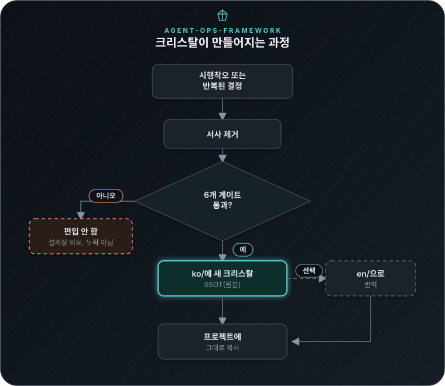

<!-- translated-from: ssot=sha256:a912dc8b70ae own=sha256:c2c803323f40 -->
# agent-ops-framework

> 🌐 **Read this page in English: [README.md](README.md)**

**"AI 에이전트 프로젝트를 어떻게 운영할 것인가"에 대한 규칙을 무료로 모아, 그대로 복사해 쓸 수 있게 만든 모음집 — 호기심 많은 고등학생부터 실무 AI 엔지니어까지, 누구나 자신에게 필요한 조각만 정확히 가져갈 수 있도록 썼다.**

이 페이지(와 그 [영문판](README.md))는 짧은 랜딩 페이지다. 37개 크리스탈 전체를 파일 단위로 설명·검증강도 배지와 함께 정리한 전체 지도는 한 단계 더 안쪽, **[`ko/README.md`](ko/README.md)**(한국어, 그 안쪽 콘텐츠의 SSOT) 또는 **[`en/README.md`](en/README.md)**(영어)에 있다 — 둘은 같은 내용이니 편한 쪽을 읽으면 된다.

---

## 한 문단 요약

AI 에이전트로 뭔가를 만든다고 하자 — 코딩 어시스턴트든, 리서치 봇이든, 여러 작업을 어느 정도 스스로 처리하는 무엇이든. 그러다 보면 성격이 전혀 다른 두 종류의 지식이 쌓인다: (1) **이 프로젝트가 실제로 무엇을 다루는가**(데이터, 사용자, 그 프로젝트만의 구체적 결정)와 (2) **그걸 어떻게 잘 운영하는가** — 작업이 "끝났다"는 걸 어떻게 판단하는지, AI가 확신에 찬 어조로 틀린 말을 하는 걸 어떻게 막는지, 비밀번호가 채팅 로그에 새나가지 않게 어떻게 보장하는지. (1)은 각 프로젝트마다 고유하다. (2)는 그렇지 않다 — 어느 AI 에이전트 프로젝트든 똑같이 겪는 문제이고, 이 저장소는 오직 (2)만을 뽑아내 재사용 가능하게 만든 것이다. 이 안의 파일 아무거나 무관한 프로젝트에 떨어뜨려도 즉시 작동한다 — 어디서 왔는지에 대한 참조를 처음부터 하나도 남기지 않고 의도적으로 썼기 때문이다.

## 왜 "크리스탈(crystal)"인가

여기 있는 규칙은 하나같이 살아있는 프로젝트 안에서의 실제 실수·실제 수정·실제 설계 결정에서 시작됐다 — 그 이력이야말로 이 규칙을 신뢰할 수 있는 *이유*다. 하지만 그 이력 자체(날짜, 프로젝트 이름, 구체적 사건)는 다른 프로젝트로 그대로 옮겨지지 않는다. 이 저장소의 각 문서는 그 교훈에서 서사를 걷어내고 재사용 가능한 패턴만 남긴 것이다 — 결정체가 자신을 키워낸 액체가 사라진 뒤에도 구조를 유지하는 것처럼. 그래서 모든 크리스탈은 자신이 **얼마나 검증됐는지**를 정직하게 표시한다(🟢 = 인용한 1차 자료를 실제로 확인함, 🟡 = 골격만 확인하고 세부는 재구성함) — 어떤 크리스탈도 실제로 확보한 것보다 더 큰 확신을 주장하지 않는다.

## 크리스탈이 만들어지는 과정

*"서사 제거"와 6개 게이트가 실제로 무엇을 확인하는지는 [BLUEPRINT.md](ko/BLUEPRINT.md)에 전체 내용이 있다 — 이 그림은 세부 규칙이 아니라 과정의 전체 모양을 보여준다.*

시작하기 전에 알아두면 좋은 두 가지:
- **한국어(`ko/`)가 SSOT(원본)인 건 영어를 지원하지 않아서가 아니라 실용적인 이유 때문이다**: 이 모음집이 계속 활발히 자라는 동안, 모든 수정마다 두 언어를 완벽히 동기화하는 건 비용이 더 큰 일이다. `en/`은 필요할 때 의도적으로 번역되고, 양방향 자동 동기화 체크(`agent-ops-framework-translation-sync-check.py`)로 관리된다 — 어느 쪽을 읽어도 같은 내용이다.
- **여기엔 "그냥 믿어라"가 없다.** 모든 크리스탈은 어떤 1차 자료가 근거이고 그 자료를 얼마나 철저히 확인했는지를 명시한다 — 크리스탈 자신이 여러분 프로젝트의 주장에도 똑같이 적용하라고 요구하는 바로 그 원칙이다([`03-epistemic-immunity-catalog.md`](ko/03-epistemic-immunity-catalog.md) 참고).

## 먼저 볼 것 (대략 이 순서로)

이걸 처음 프로젝트에 들여온다면 37개 크리스탈을 전부 한 번에 읽으려 하지 말 것 — 아래를 이 순서로 보고, 나머지는 각 문서 자신의 "왜 필요한가" 절이 실제로 자기 상황에 해당될 때만 챙긴다:

1. **[`07-prompt-guardrails/`](ko/07-prompt-guardrails/)** — 개인정보를 다루는 첫 작업이 생기기 *전에* 반드시 먼저. 이건 다른 것들과 다르다 — 읽을 원칙이 아니라 **그대로 복사해서 실행하는 코드**다(훅, 스캐너, 마스킹 스크립트).
2. **[`01-definition-of-done.md`](ko/01-definition-of-done.md)** — 작업이 몇 개를 넘어가기 시작하면.
3. **[`05-autonomous-agent-operating-principles.md`](ko/05-autonomous-agent-operating-principles.md)** — 에이전트가 사람의 매 단계 확인 없이 반복 실행되기 시작하면.
4. **[`02-directive-registry.md`](ko/02-directive-registry.md)** — 결정이 쌓이기 시작해 "잠깐, 이거 왜 이렇게 정했지?"라는 질문이 반복되면.
5. **[`09-project-structure-template.md`](ko/09-project-structure-template.md)** — 프로젝트 구조 자체를 설계(또는 재설계)할 때.
6. **[`03-epistemic-immunity-catalog.md`](ko/03-epistemic-immunity-catalog.md)**와 **[`04-eval-engineering-methodology.md`](ko/04-eval-engineering-methodology.md)** — 산출물 품질을 눈대중이 아니라 처음으로 진지하게 측정해야 할 때.

## 적용된 모습으로 보기

**[`examples/`](examples/)** — 데모 에이전트 세 개. 그중 둘은 API 키 없이
바로 돌려볼 수 있고, 37개 크리스탈 중 25개를 실제로 동작하는 코드로
보여준다: [`issue-triage-agent/`](examples/issue-triage-agent/)(반응형
개별 항목 분류기)와
[`research-digest-agent/`](examples/research-digest-agent/)(자율
반복·자가개선형 루프). 세 번째
[`escalation-reviewer-agent/`](examples/escalation-reviewer-agent/)는
성격이 다르다 — 이 저장소에서 유일하게 **진짜** LLM 에이전트를 실제로
호출해(격리된, 자기 작업만 아는 컨텍스트로) 이 프레임워크의 원칙으로
거버넌스를 씌운 사례이고, 실제로 각본 없이 발견된 보안 허점도 담겨있다.
각각의 `CASE-STUDY.md`(영어)가 크리스탈이 실제로 어느 파일·어느 줄을
바꿨는지(또는 무엇을 증명했는지) 하나씩 짚어준다 — 크리스탈이 뭐라고
말하는지 요약한 게 아니라, 그 크리스탈 때문에 실제로 무엇이 달라졌는지를
보여준다.

## 전체 지도 — 9개 카테고리, 37개 크리스탈

크리스탈 번호는 영구 ID다(추가된 순서이지 중요도 순위가 아니다 — 이유는 `ko/README.md`의 "번호는 추가 순서다, 중요도가 아니다" 절 참고; GitHub이 한글 헤딩에 자동 생성하는 앵커 슬러그는 직접 링크할 만큼 안정적이지 않아, 여기서는 프래그먼트가 아니라 파일 자체를 가리킨다). 아래는 카테고리 단위 지도다 — 37개 전체의 설명과 검증 배지가 담긴 완전한 파일별 표는 **[`ko/README.md`](ko/README.md)**(또는 [`en/README.md`](en/README.md) — 내용 동일) 참고.

| 카테고리 | 답하는 질문 | 예시 크리스탈 |
|---|---|---|
| **거버넌스·의사결정** | 누가, 언제 결정하는가? | [`02`](ko/02-directive-registry.md) 지시 레지스트리, [`05`](ko/05-autonomous-agent-operating-principles.md) 자율 에이전트 정지/계속 규칙, [`20`](ko/20-decision-rights-raci.md) 공유 에이전트를 위한 RACI |
| **품질·검증 — 다 만들었는가, 얼마나 좋은가** | 언제 작업이 끝났다고 부를 수 있고, 그 기준은 무엇인가? | [`01`](ko/01-definition-of-done.md) 10개 항목 Definition of Done, [`13`](ko/13-debt-and-quality-bar.md) 부채 분류 + 품질 최저선 |
| **품질·검증 — 근거를 측정하고 신뢰하기** | 실제로 믿을 수 있는 측정을 어떻게 설계하는가? | [`04`](ko/04-eval-engineering-methodology.md) 평가 엔지니어링 파이프라인, [`22`](ko/22-llm-benchmark-literacy.md) 벤치마크 수치를 비판적으로 읽는 법 |
| **안전·보안 — 정보 유출** | 무엇이, 어떤 통로로 새나가는가? | **[`07`](ko/07-prompt-guardrails/) 실행 가능한 프롬프트 가드레일 코드**, [`23`](ko/23-confidential-project-protection.md) 기밀 프로젝트 push 차단 |
| **안전·보안 — 판단·추론** | AI/사람의 추론이 그럴듯하지만 *틀린* 지점은 어디인가? | [`03`](ko/03-epistemic-immunity-catalog.md) 그럴듯하지만 가짜인 추론 12패턴, [`14`](ko/14-ai-red-team-checklist.md) 적대적 위협 체크리스트 |
| **사고대응·복원력** | 실제로 뭔가 터졌을 때 어떻게 대응하는가? | [`12`](ko/12-blameless-postmortem-template.md) 비난 없는 포스트모템 템플릿, [`19`](ko/19-chaos-engineering-for-agents.md) 에이전트를 위한 카오스 엔지니어링 |
| **관측·자가학습** | 무슨 일이 있었는지 어떻게 기록하고 실제로 학습하는가? | [`06`](ko/06-self-improving-heuristics-loop.md) 자가학습 휴리스틱 루프, [`11`](ko/11-observability-and-agent-tracing.md) 주장이 아니라 로그로 남기기 |
| **상호작용·문서화** | 사람에게 무엇을, 어떻게 보여주는가? | [`10`](ko/10-human-ai-interaction-guidelines.md) 18개 인간-AI 상호작용 가이드라인, [`15`](ko/15-model-card-template.md) 모델 카드 템플릿 |
| **구조·재사용** | 여러 프로젝트 사이에서 어떻게 패키징하고 옮기는가? | [`08`](ko/08-module-format.md) 이식 가능한 모듈 포맷, [`09`](ko/09-project-structure-template.md) 5레이어 프로젝트 구조 |

## 참고 문서

| 문서 | 무엇을 위한 것인가 |
|---|---|
| [`ko/BLUEPRINT.md`](ko/BLUEPRINT.md) | 이 폴더가 무엇이고, 새 크리스탈이 통과해야 하는 6개 게이트, 편입 후보가 자동으로 어떻게 발견되는가 |
| [`ko/USAGE-GUIDE.md`](ko/USAGE-GUIDE.md) | 기획·설계·구현·개선·참조 단계에서 실제로 어떻게 쓰는가 |
| [`ko/RISK-ANALYSIS.md`](ko/RISK-ANALYSIS.md) | 이 모음집이 추출되기 전에 거친 공개 안전성 검토 |
| [`ko/DISCLAIMER.md`](ko/DISCLAIMER.md) | 실제로 게시할 때 바로 쓸 수 있는 고지문 템플릿 |
| [`ko/LANGUAGE-POLICY.md`](ko/LANGUAGE-POLICY.md) | AI 에이전트가 기본으로 어느 언어를 읽어야 하는지와 그 예외 |
| [`ko/GLOSSARY.md`](ko/GLOSSARY.md) | 이 폴더가 반복해서 쓰는 용어(크리스탈, 서사, 도메인 무관, SSOT, 게이트, STALE/DIVERGED 등)의 뜻을 한곳에 모은 색인 |
| [`CONTRIBUTING.md`](CONTRIBUTING.md) | 크리스탈을 제안·수정하는 법, 실제 git/PR 절차, PR이 통과해야 하는 기준 |
| [`SECURITY.md`](SECURITY.md) | 취약점을 어떻게 보고하는지, 실제 스코프가 무엇인지(`07-prompt-guardrails/`의 실행 코드) |
| [`CODE_OF_CONDUCT.md`](CODE_OF_CONDUCT.md) | Contributor Covenant v2.1 원문 |
| [`LICENSE`](LICENSE) | MIT |

## 이것은 아닌 것

- 여러분 프로젝트의 실제 콘텐츠를 대체하지 않는다 — 그건 여전히 100% 여러분의 것이다.
- 독립적으로 재검증된 별도의 무언가가 아니다 — 각 크리스탈은 그 원본 프로젝트 *안에서* 일어난 검증을 요약한 것이고, 검증 배지는 정확히 그만큼만 확인됐다는 뜻이지 그 이상이 아니다.
- 단일 기능 패키징 포맷이 아니다(그건 더 좁은 별개의 관심사다) — 이건 프로젝트 전체의 *운영 방식*을 추출한 것이다.
