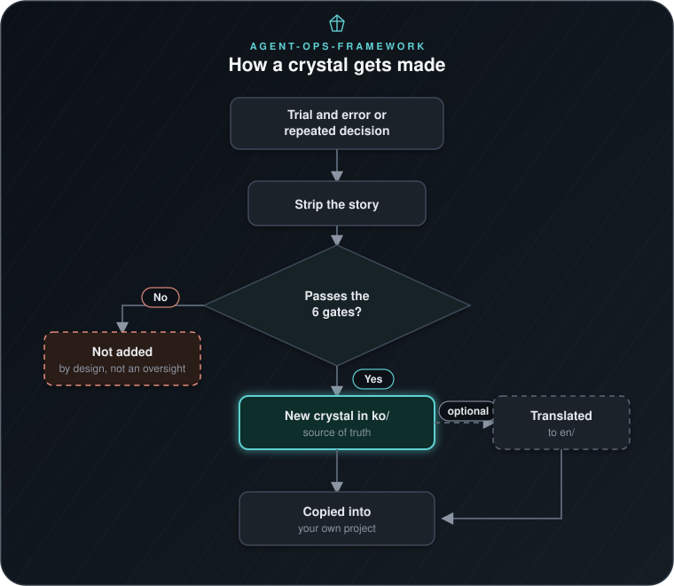

# agent-ops-framework — A Collection of Structural Crystals for Operating AI-Agent Projects

> 🌐 **이 페이지를 한국어로 보기: [README.ko.md](README.ko.md)**
> 🖼 **[A one-page visual overview of this whole repo](https://claude.ai/code/artifact/18574a68-d92e-45db-a505-db0b038ac284)** — same content as this README, laid out for skimming.

**A copy-paste collection of "how to run an AI-agent project" rules, written so that anyone can pick up exactly the piece they need.**

This page (and its [Korean translation](README.ko.md)) is a short landing page. The full, file-by-file map of all 37 crystals — with a description and a verification badge for each — lives one level deeper, in **[`en/README.md`](en/README.md)** (English) or **[`ko/README.md`](ko/README.md)** (Korean, the source of truth for that deeper content); both say the same thing, so read whichever you're comfortable in.

---

## The one-paragraph version

Say you're building something with an AI agent — a coding assistant, a research bot, anything that runs multiple tasks somewhat on its own. Two very different kinds of knowledge pile up as you go: (1) **what the project is actually about** (its data, its users, its specific decisions) and (2) **how you run it well** — how you know a task is "done," how you stop the agent from confidently saying wrong things, how you make sure it never leaks a password into a chat log. Type (1) is unique to your project. Type (2) is not — it's the same problem in every AI-agent project, and this repository is nothing but type (2), extracted and made reusable. Drop any of these files into an unrelated project and they work immediately, because they were deliberately written with zero references to where they came from.

## Why "crystal"?

Each rule here started as a real mistake, a real fix, or a real design decision inside a live project — that history is *why* the rule can be trusted, but the history itself (dates, project names, specific incidents) doesn't travel well to a different project. Each document in this repo is that lesson with the story stripped out and only the reusable pattern left — the way a crystal keeps its structure after the liquid it grew in is gone. That's also why every crystal is honestly labeled with **how well-verified** it is (🟢 = the cited primary source was actually checked; 🟡 = only the outline was confirmed, details reconstructed) — no crystal claims more confidence than it earned.

## How a crystal gets made

*Full detail on what "strip the story" and the 6 gates actually check lives in [BLUEPRINT.md](ko/BLUEPRINT.md) — this diagram shows the shape of the process, not every rule.*

Two things worth knowing before you dive in:
- **Korean (`ko/`) is the source of truth for one practical reason.** While this collection is still actively growing, keeping two languages perfectly in sync on every edit would cost more than it's worth — that's the entire reason; it says nothing about whether English is supported. `en/` is translated deliberately and kept in sync by an automated two-way check (`agent-ops-framework-translation-sync-check.py`) — you can read either one, they say the same thing.
- **Nothing here is "trust me."** Every crystal states which primary source backs it and how thoroughly that source was actually checked — the same discipline the crystals themselves ask you to apply to your own project's claims (see [`03-epistemic-immunity-catalog.md`](ko/03-epistemic-immunity-catalog.md)).

## Start here (in roughly this order)

If you're adding this to a project for the first time, don't try to read all 37 crystals — read these, in this order, and pick up the rest only when a document's own "why this matters" section actually applies to you:

1. **[`07-prompt-guardrails/`](ko/07-prompt-guardrails/)** — do this *before* your first task that touches personal data, not after. This one is different from the rest: it's not a principle to read, it's **working code you copy and run** (a hook, a scanner, a masking script).
2. **[`01-definition-of-done.md`](ko/01-definition-of-done.md)** — once you have more than a handful of tasks going.
3. **[`05-autonomous-agent-operating-principles.md`](ko/05-autonomous-agent-operating-principles.md)** — once the agent starts running repeatedly without a human checking every step.
4. **[`02-directive-registry.md`](ko/02-directive-registry.md)** — once decisions start piling up and you catch yourself asking "wait, why did we decide that?"
5. **[`09-project-structure-template.md`](ko/09-project-structure-template.md)** — when you're designing (or redesigning) the project's structure itself.
6. **[`03-epistemic-immunity-catalog.md`](ko/03-epistemic-immunity-catalog.md)** and **[`04-eval-engineering-methodology.md`](ko/04-eval-engineering-methodology.md)** — the first time you need to seriously measure output quality, not just eyeball it.

## See it applied

Two agents in [`examples/`](examples/) run with nothing but Python — no
API key, no setup.
[`issue-triage-agent/`](examples/issue-triage-agent/) classifies
incoming tickets; [`research-digest-agent/`](examples/research-digest-agent/)
runs on a recurring loop and updates its own heuristics as it goes.
Between the two, their code covers 25 of the 37 crystals.

The third example breaks that pattern.
[`escalation-reviewer-agent/`](examples/escalation-reviewer-agent/)
hands real tickets to an actual LLM agent — one told nothing except the
single ticket in front of it — and writes up exactly what happened,
including a real security gap the run turned up on its own.

Every example comes with a `CASE-STUDY.md` that names the file and line
a crystal actually changed, not just the idea behind it.

## The full map — 37 crystals in 9 categories

Every crystal number is a permanent ID (the order it was added, not a ranking — see `ko/README.md`'s "번호는 추가 순서다, 중요도가 아니다" section for why; GitHub's auto-generated anchor slugs for Korean headings aren't reliable enough to link to directly, so this points at the file, not a fragment). Below is the category-level map; for the complete file-by-file table with a description and a verification badge for each of the 37, see **[`en/README.md`](en/README.md)** (or [`ko/README.md`](ko/README.md) — identical content).

| Category | Answers the question | Example crystals |
|---|---|---|
| **Governance & decision-making** | Who decides what, and when? | [`02`](ko/02-directive-registry.md) directive registry, [`05`](ko/05-autonomous-agent-operating-principles.md) autonomous-agent stop/go rules, [`20`](ko/20-decision-rights-raci.md) RACI for shared agents |
| **Quality & verification — is it done, how good is it** | When can you call a task finished, and by what bar? | [`01`](ko/01-definition-of-done.md) 10-point definition of done, [`13`](ko/13-debt-and-quality-bar.md) debt taxonomy + quality floor |
| **Quality & verification — measuring & trusting evidence** | How do you design a measurement you can actually trust? | [`04`](ko/04-eval-engineering-methodology.md) eval-engineering pipeline, [`22`](ko/22-llm-benchmark-literacy.md) reading benchmark numbers critically |
| **Safety & security — information leakage** | What leaks, and through which door? | **[`07`](ko/07-prompt-guardrails/) executable prompt-guardrail code**, [`23`](ko/23-confidential-project-protection.md) confidential-project push blocking |
| **Safety & security — judgment & reasoning** | Where does AI/human reasoning sound right but *be* wrong? | [`03`](ko/03-epistemic-immunity-catalog.md) 12 patterns of plausible-but-fake reasoning, [`14`](ko/14-ai-red-team-checklist.md) adversarial-threat checklist |
| **Incident response & resilience** | How do you handle it when something actually breaks? | [`12`](ko/12-blameless-postmortem-template.md) blameless postmortem template, [`19`](ko/19-chaos-engineering-for-agents.md) chaos engineering for agents |
| **Observability & self-learning** | How do you record what happened and actually learn from it? | [`06`](ko/06-self-improving-heuristics-loop.md) self-improving heuristics loop, [`11`](ko/11-observability-and-agent-tracing.md) trace-don't-claim logging |
| **Interaction & documentation** | What do you show a human, and how? | [`10`](ko/10-human-ai-interaction-guidelines.md) 18 human-AI interaction guidelines, [`15`](ko/15-model-card-template.md) model card template |
| **Structure & reuse** | How do you package and move things between projects? | [`08`](ko/08-module-format.md) portable module format, [`09`](ko/09-project-structure-template.md) 5-layer project structure |

## Reference documents

| Document | What it's for |
|---|---|
| [`ko/BLUEPRINT.md`](ko/BLUEPRINT.md) | What this folder is, the 6-gate quality bar a new crystal must clear, and how candidates get found automatically |
| [`ko/USAGE-GUIDE.md`](ko/USAGE-GUIDE.md) | How to actually use this while planning, designing, building, improving, or referencing a project |
| [`ko/RISK-ANALYSIS.md`](ko/RISK-ANALYSIS.md) | The public-safety review this collection went through before being extracted |
| [`ko/DISCLAIMER.md`](ko/DISCLAIMER.md) | A ready-to-use disclaimer template for when you actually publish |
| [`ko/LANGUAGE-POLICY.md`](ko/LANGUAGE-POLICY.md) | Which language an AI agent should default to reading, and the exceptions |
| [`ko/GLOSSARY.md`](ko/GLOSSARY.md) | What this folder's recurring terms (crystal, story, domain-neutral, SSOT, gate, STALE/DIVERGED, ...) actually mean, in one place |
| [`CONTRIBUTING.md`](CONTRIBUTING.md) | How to propose or edit a crystal, the actual git/PR mechanics, and the bar a pull request needs to clear |
| [`SECURITY.md`](SECURITY.md) | How to report a vulnerability, and what's actually in scope (the executable code in `07-prompt-guardrails/`) |
| [`CODE_OF_CONDUCT.md`](CODE_OF_CONDUCT.md) | Contributor Covenant v2.1, verbatim |
| [`LICENSE`](LICENSE) | MIT |

## What this is *not*

- Not a replacement for your project's actual content — that's still 100% yours.
- Not independently re-verified as a standalone thing — each crystal summarizes verification that happened *inside* its origin project; the verification badges say exactly how far that checking went, not more.
- Not a single-feature packaging format (that's a different, narrower concern) — this is a whole project's *operating practice*, extracted.
